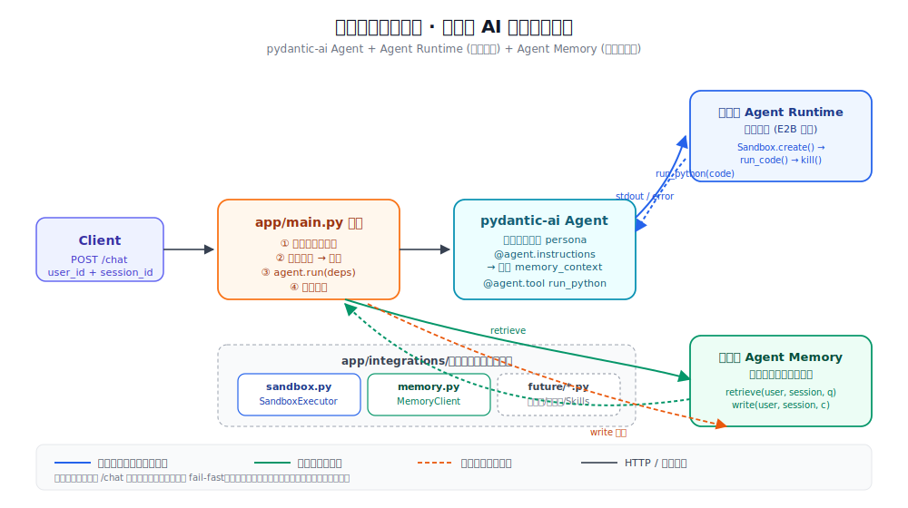

# pydantic-agent-on-tencentcloud

terraform + pydantic agent on Tencent Cloud.

## Multica 多智能体工作流

本仓库已接入 Multica 多智能体 GitHub 事件驱动工作流。
打 issue 标签会触发对应角色 agent：

| 标签 | 触发角色 |
|---|---|
| `needs-design` | Designer-A |
| `needs-plan` | Planner-A |
| `ready-for-dev` / `changes-requested` | Developer |
| `ready-for-test` | Tester |
| `ready-for-acceptance` | Reviewer |

转发逻辑见 `.github/workflows/multica-dispatch.yml`。

---

## 应用与部署

一个基于 [pydantic-ai](https://ai.pydantic.dev/) 的 **「智能数据分析助手 / Data Analyst
Copilot」** showcase：FastAPI + uvicorn 暴露 `/chat`（带 `user_id` + `session_id` 的多用户
多会话）与 `/healthz`，整合两个腾讯云 AI 产品：

- **腾讯云 Agent Runtime**（代码沙箱，E2B 兼容）—— 让模型生成的分析代码只在腾讯云
  沙箱内安全执行。
- **腾讯云数据库 Agent Memory** —— 跨会话个性化记忆（用户偏好、历史结论、团队规范）的
  检索注入与沉淀写回。

Terraform 一键拉起腾讯云资源（VPC / 子网 / 安全组 / CVM / NAT 网关 / CLB）。

### Showcase 业务流程

单次 `/chat` 流程（详见 [BUB-25 设计](docs/designs/BUB-25-tencentcloud-ai-integration.md)）：



1. Client 带 `user_id` + `session_id` POST `/chat`。
2. `app/main.py` 从 Agent Memory 检索个性化上下文并注入 agent 动态 instructions。
3. agent 按需调用 `run_python` 工具，把分析代码提交 Agent Runtime 代码沙箱执行。
4. 把本轮 user / assistant 消息写回 Memory 沉淀。
5. 返回结论。

可插拔集成层 `app/integrations/`：后续接入新的腾讯云 AI 产品（浏览器沙箱、知识库、Skills 等）
只需新增一个模块 + 在 agent 注册一个工具/上下文来源。

### 本地运行

需要 Python ≥ 3.11 与 [`uv`](https://docs.astral.sh/uv/)。

```bash
uv sync
uv run uvicorn app.main:app --port 8000
# 另一个终端：
curl localhost:8000/healthz
# -> {"status":"ok", "integrations": {"sandbox":"configured|missing", "memory":"configured|missing"}}
```

调 `/chat` 需要：
- 模型 provider 的 API key（默认 OpenAI；详见下文）。
- **腾讯云 Agent Runtime API Key 与沙箱工具名**（运行核心能力，缺则 `/chat` 返回 500）。
- **腾讯云 Agent Memory 实例端点与 API Key**（缺则降级为「无记忆」模式，对话不受影响）。

两种方式二选一：

**方式 A：命令前缀注入**（适合一次性试用）

```bash
MODEL_API_KEY=sk-xxx uv run uvicorn app.main:app --port 8000
curl -X POST localhost:8000/chat -H 'Content-Type: application/json' \
  -d '{"message":"现在几点？"}'
# -> {"reply":"...含 ISO 时间..."}（证明 server_time 工具被调用）
```

**方式 B：用 `.env` 文件**（推荐本地长期开发）

```bash
cp .env.example .env
# 编辑 .env，填入真实 MODEL_API_KEY 等
touch .env   # 仅本地，勿提交
uv run uvicorn app.main:app --port 8000
```

`.env` 是本仓库根目录的本地配置文件：应用启动时自动加载（`app/__init__.py` 调
`python-dotenv` 的 `load_dotenv()`），把其中的 `MODEL_*` 等键值读进 `os.environ`，
不必再拼命令前缀。优先级为 **真实进程环境变量 > `.env` 文件 > 代码内置默认值**
（`override=False`，即命令行/部署注入的环境变量永远优先于 `.env`，不会被本地文件覆盖）。

> `.env` 含真实密钥，已被 `.gitignore` 忽略，**绝不提交**；仓库只追踪不含密钥的
> `.env.example` 模板。
>
> 部署侧（腾讯云 CVM）不受影响——仍由 Terraform 写入 `/etc/agent/env`，systemd
> `EnvironmentFile` 注入，与本地的 `.env`（按 CWD 查找）路径不同、互不干扰。

模型串可经 `MODEL_STRING` 切换 provider，例如 `openai:gpt-4o-mini`、
国内可达 provider 等（同样可写进 `.env`）。

### 切换到智谱（GLM）/ DeepSeek

通过 `MODEL_PROVIDER` 选择模型后端，零新依赖（DeepSeek 走 pydantic-ai 原生 provider，
智谱走 OpenAI 兼容接口）。**API key 仍统一用 `MODEL_API_KEY` 一个变量**——DeepSeek
和智谱都只用它，无需单独设 `DEEPSEEK_API_KEY` / `ZHIPU_API_KEY`（后者仅作高级用户
本地实验回退）。

| `MODEL_PROVIDER` | `MODEL_STRING` 示例 | 说明 |
|---|---|---|
| `openai`（默认） | `openai:gpt-4o-mini` | 向后兼容现状 |
| `deepseek` | `deepseek-chat` | pydantic-ai 原生 provider |
| `zhipu` | `glm-4` | OpenAI 兼容端点（`open.bigmodel.cn`） |
| `tokenhub` | `gpt-4o-mini` | OpenAI 兼容端点，**须额外设 `MODEL_BASE_URL`** |

> `tokenhub` 走 OpenAI 兼容协议，但端点不固定，需用 `MODEL_BASE_URL` 指定其
> base_url（如 `http://<host>/tokenhub/v1`）；部署侧对应 `infra/` 的 `model_base_url`
> 变量（见 `infra/terraform.tfvars.example`）。`openai`/`deepseek`/`zhipu` 无需设置，
> 留空即走各自代码默认端点。

本地：

```bash
# DeepSeek
MODEL_PROVIDER=deepseek MODEL_STRING=deepseek-chat MODEL_API_KEY=sk-xxx uv run uvicorn app.main:app --port 8000
# 智谱
MODEL_PROVIDER=zhipu MODEL_STRING=glm-4 MODEL_API_KEY=sk-xxx uv run uvicorn app.main:app --port 8000
```

部署时把 `MODEL_PROVIDER` 也写进 Terraform（对应 `infra/` 的 `model_provider` 变量，
默认 `openai`，见 `infra/terraform.tfvars.example`）。

> 注意：`deepseek-reasoner` 等模型对工具调用支持有限；智谱个别高级字段可能不完全
> 兼容 OpenAI 语义——遇到异常优先换 `deepseek-chat` / `glm-4` 这类主流模型。

### 测试

```bash
uv run pytest
```

`tests/test_agent.py` 用 pydantic-ai 的 `TestModel` 做无网测试，验证 agent 可构造、
`server_time` 工具可被触发，全程不需要任何 API key / 不触网。

### 部署到腾讯云（Terraform）

基础设施全部由 `infra/` 下的 Terraform 管理，复用
[tencentcloud-landing-zone-booster](https://github.com/terraform-tencentcloud-modules/tencentcloud-landing-zone-booster)
模块（锁定到 git tag `v0.1.0`）。

> ⚠️ 所有敏感凭证（腾讯云 `secret_id`/`secret_key`、`model_api_key`）**只**经
> `TF_VAR_*` 环境变量注入，绝不写进 `.tf` / `.tfvars`。`*.tfvars` 已被
> `.gitignore` 忽略（保留 `*.tfvars.example`）。

```bash
export TF_VAR_tencentcloud_secret_id=AKID...
export TF_VAR_tencentcloud_secret_key=...
export TF_VAR_model_api_key=sk-xxx

cd infra
terraform init
terraform plan
terraform apply

# 应用起来后：
terraform output -raw service_url  # -> http(s)://<CLB VIP>
```

CVM 创建后由 TAT（腾讯云自动化助手）下发部署命令：`git clone` 本仓库 → `uv sync`
→ 安装并启动 systemd 服务 `agent`（监听 8000）。CLB 终止 HTTPS（无证书时退化为
HTTP:80）并转发到 CVM:8000。

> TAT 部署相比 user-data 可在控制台/CLI 重复执行并查看每次的 stdout/stderr，便于
> 调试。脚本更新后重新在机器上执行：
> `terraform apply -replace=tencentcloud_tat_invocation_invoke_attachment.deploy_app`。

### 端到端验证

```bash
URL=$(terraform -chdir=infra output -raw service_url)

# 基本：server_time 工具
curl -X POST "$URL/chat" -H 'Content-Type: application/json' \
  -d '{"message":"现在几点？","user_id":"demo","session_id":"s1"}'
# -> {"reply":"...含时间字符串..."}

# Showcase：触发 Agent Runtime 代码沙箱
curl -X POST "$URL/chat" -H 'Content-Type: application/json' \
  -d '{"message":"用 python 计算 1..100 的和并打印结果","user_id":"demo","session_id":"s1"}'
# -> 模型调用 run_python；reply 含腾讯云沙箱执行结果 5050

# 验证 Memory 跨会话个性化（先告知偏好，再换一个问题）
curl -X POST "$URL/chat" -H 'Content-Type: application/json' \
  -d '{"message":"以后给我看销售数据时优先用折线图","user_id":"demo","session_id":"s1"}'
curl -X POST "$URL/chat" -H 'Content-Type: application/json' \
  -d '{"message":"我们上个月的销售数据应该怎么呈现？","user_id":"demo","session_id":"s2"}'
# -> 第二次回答应该会基于跨会话记忆推荐折线图
```

### 初次配置：创建 Agent Runtime 沙箱工具

应用启动前，需在腾讯云 Agent Runtime 上**创建一个 `code-interpreter` 类型的沙箱
工具**——它对应 `e2b-code-interpreter` SDK 的 `template` 参数，即本仓库的
`SANDBOX_TEMPLATE` 环境变量。

仓库提供一键脚本，自动检测 `agr` CLI 参数风格、创建工具、轮询等待 ACTIVE：

```bash
# 1. 安装 agr CLI（一次）
curl -fsSL https://dl.tencentags.com/agr-cli/latest/install.sh | sh

# 2. 注入云账号凭证（agr 用云 SecretId/Key 操作 tool/instance 生命周期；
#    这与运行时的 E2B_API_KEY 是不同体系，下面环境变量表会再说明）
agr init --secret-id "$TENCENTCLOUD_SECRET_ID" \
         --secret-key "$TENCENTCLOUD_SECRET_KEY" --non-interactive

# 3. 创建沙箱工具（默认名 data-analyst-py、code-interpreter 类型、SANDBOX 网络隔离）
bash scripts/provision_sandbox_tool.sh

# 自定义名字：TOOL_NAME=my-tool bash scripts/provision_sandbox_tool.sh
# 仅看将执行的命令：bash scripts/provision_sandbox_tool.sh --dry-run
```

脚本结束时会打印 `SANDBOX_TEMPLATE` 应填入的值，把它写进 `.env` 或
`infra/terraform.tfvars` 即可。

> 等价的手工命令（脚本就是这一条 + 轮询）：
> ```bash
> agr tool create \
>   --tool-name data-analyst-py \
>   --tool-type code-interpreter \
>   --network-configuration '{"NetworkMode":"SANDBOX"}' \
>   -o json --non-interactive
> ```
> 若 `agr` 版本较旧报 `unknown flag --tool-name`，改用旧参数风格：
> `--name data-analyst-py --type code-interpreter --network SANDBOX --timeout 10m`。

### 灰度部署：把特性分支先在 CVM 上跑通再合 main

部署脚本（`scripts/deploy_app.sh.tftpl` 与手工 `scripts/deploy_app.sh`）支持把
**任意 git ref**（分支 / tag / commit sha）部署到 CVM，无需先合 main。这给"先在
真实环境验证再合主干"的工作流提供了原生支持。

| 变量 | 默认 | 用途 |
|---|---|---|
| `app_git_repo`（TF）/ `APP_GIT_REPO`（手工脚本） | `https://github.com/ritchiecai/pydantic-agent-on-tencentcloud.git` | 应用源码仓库 URL，使用 fork 时覆盖 |
| `app_git_ref`（TF）/ `APP_GIT_REF`（手工脚本） | `main` | 要部署的 git ref（分支 / tag / 完整 commit sha） |

#### Terraform 灰度

```bash
# 验证特性分支
export TF_VAR_app_git_ref=feat/tencentcloud-ai-integration
terraform -chdir=infra apply \
  -replace=tencentcloud_tat_invocation_invoke_attachment.deploy_app

# 测试通过后合 PR 到 main，把 ref 改回去重发一次（或直接走默认值）
unset TF_VAR_app_git_ref
terraform -chdir=infra apply \
  -replace=tencentcloud_tat_invocation_invoke_attachment.deploy_app
```

> 部署脚本会智能切换：clone 时若 ref 是分支或 tag 走 `git clone --branch`；若是
> commit sha 则先 clone 默认分支再 detach checkout。已存在仓库时 `fetch + checkout
> + reset --hard origin/<ref>`（仅当是分支时），保证幂等可重入。脚本开头会
> echo 当前 commit sha，便于在 TAT 日志里溯源。

#### 手工 SSH 部署灰度

```bash
APP_GIT_REF=feat/tencentcloud-ai-integration ./scripts/deploy_app.sh
```

#### 切换 fork

`TF_VAR_app_git_repo=https://github.com/<your-fork>/pydantic-agent-on-tencentcloud.git`
即可。脚本检测到 origin URL 变化会自动重新 clone（避免远端不一致冲突）。

### PyPI 镜像加速（CVM 上的 uv sync）

CVM 默认从 PyPI 拉包很慢——pypi.org 在境外。部署脚本默认走**腾讯云软件源**：
`https://mirrors.cloud.tencent.com/pypi/simple`，CVM 内网直连免流，速度可达
几十~上百 MB/s。具体注入：

- `deploy_app.sh.tftpl` 在 `uv sync` 前 `export UV_DEFAULT_INDEX=$pip_index_url`
- `UV_HTTP_TIMEOUT=120`：慢源场景抬高重连窗口
- `UV_PYTHON_INSTALL_MIRROR=https://mirrors.cloud.tencent.com/python-build-standalone`：
  uv 自动安装 Python 解释器时也走腾讯云镜像

**覆盖镜像**：

```bash
# Terraform：换源
terraform apply -var='pip_index_url=https://pypi.tuna.tsinghua.edu.cn/simple'
# 或用空字符串走 uv 默认 pypi.org（不推荐）：
terraform apply -var='pip_index_url='

# 手工 SSH 部署：
PIP_INDEX_URL=https://pypi.tuna.tsinghua.edu.cn/simple ./scripts/deploy_app.sh
```

> 本地开发不强制——多数本地网络拉 pypi.org 已足够快，且 `vendor/` 下的本地 wheel
> 由 `[tool.uv.sources]` 锁定为文件系统路径，不受镜像设置影响。如本地也想加速，
> 可在 shell 里 `export UV_DEFAULT_INDEX=https://mirrors.cloud.tencent.com/pypi/simple`。

### 新增的腾讯云 AI 产品环境变量

| 变量 | 必填 | 来源 / 默认 |
|---|---|---|
| `E2B_API_KEY` | ✅ | Agent Runtime 控制台「API Keys」创建，形如 `ark_xxxx` |
| `SANDBOX_TEMPLATE` | ✅ | Agent Runtime 控制台「沙箱工具」名称 |
| `E2B_DOMAIN` | ⛔ | 默认 `ap-guangzhou.tencentags.com`（按地域改） |
| `SANDBOX_TIMEOUT` / `SANDBOX_RUN_TIMEOUT` | ⛔ | 沙箱存活/单次执行超时秒数，默认 600 / 120 |
| `AGENT_MEMORY_ENDPOINT` | ✅ | Memory 实例「API 接入」展示的访问地址 |
| `AGENT_MEMORY_API_KEY` | ✅ | Memory 实例「获取密钥」生成 |
| `AGENT_MEMORY_SERVICE_ID` | ✅ | Memory 实例 ID（控制台「实例列表」可见，形如 `mem-xxxxxxxx`）；SDK 鉴权头 `x-tdai-service-id` 必需 |
| `AGENT_MEMORY_TOP_K` / `AGENT_MEMORY_TIMEOUT` | ⛔ | 召回上限/HTTP 超时，默认 5 / 10 |

Terraform 侧两个 sensitive key 经 `TF_VAR_*` 注入：

```bash
export TF_VAR_runtime_api_key=ark_xxx
export TF_VAR_memory_api_key=xxx
# 非敏感项（如 memory_service_id）写进 infra/terraform.tfvars 或保持默认。
```

### Agent Memory 官方 Python SDK（vendor/ + 可选 extra）

腾讯云数据库 Agent Memory 官方 Python SDK `tencentdb-agent-memory-sdk-python`
**未上 PyPI**，由腾讯云以本地 wheel 形式下发。本仓库采用 **`vendor/` + uv optional
extra** 的方式整合，无需手工 `pip install`：

```
vendor/
├─ README.md                                                  # 详细说明
├─ _make_placeholder_wheel.py                                 # 占位 wheel 生成脚本
└─ tencentdb_agent_memory_sdk_python-0.1.0-py3-none-any.whl   # ← 替换为真 wheel 即可
```

**默认状态**：仓库自带一个 ~1KB 的**占位 wheel**（metadata 合法、不导出任何模块），
让 `uv sync` 在没有真 wheel 时也能正常锁定依赖。`MemoryClient` 运行时探测到无可
import 模块即回退 `_HttpBackend`，功能不受影响。

**启用真 SDK**：

```bash
# 1) 从腾讯云控制台获取真 wheel（保持文件名不变）：
#    tencentdb_agent_memory_sdk_python-0.1.0-py3-none-any.whl
# 2) 覆盖 vendor/ 下的同名占位 wheel
cp ~/Downloads/tencentdb_agent_memory_sdk_python-0.1.0-py3-none-any.whl vendor/
# 3) sync 时启用 memory-sdk extra
uv sync --extra memory-sdk
```

应用代码零改动，`MemoryClient` 自动切到 `_SdkBackend`：调用官方 SDK 的
`add_conversation` / `search_conversation`（语义检索），获得 Memory 完整的金字塔
记忆与向量检索能力。

**部署侧（CVM）**：`scripts/deploy_app.sh.tftpl` 始终用 `uv sync --extra memory-sdk`。
vendor/ 跟随 `git clone` 一起到达 CVM——真 wheel 已替换时自动启用 SDK，未替换则
继续走 HTTP 兜底，无需在 Terraform / 部署端做额外配置。

**多用户隔离**：SDK 的「原始对话层」按 `session_id` 维度组织、无独立 `user_id`
字段。本服务对外保留 `(user_id, session_id)` 双标识，内部合成
`effective_session_id = "{user_id}:{session_id}"` 作为 SDK 的 `session_id`。调用方
零感知。

> 详细的版本升级流程与安全须知见 [`vendor/README.md`](vendor/README.md)。

### 日志

应用通过标准库 `logging` 输出日志，是否落地文件由 `LOG_FILE` 决定：

- **不设 `LOG_FILE`**（本地默认）：仅输出到 stdout，沿用 uvicorn 默认行为。
- **设了 `LOG_FILE`**：用 `RotatingFileHandler` 把应用日志与 uvicorn 的访问/错误
  日志一并写入该文件，按大小轮转（默认 10MB × 5 份，可经 `LOG_MAX_BYTES` /
  `LOG_BACKUP_COUNT` 调整）。`/chat` 仅记录消息长度，不落盘正文，避免敏感信息入日志。

部署侧由 `deploy_app.sh.tftpl` 固定写入 `LOG_FILE=/var/log/agent/app.log` 并创建
`/var/log/agent` 目录，因此 CVM 上既能 `journalctl -u agent` 看 systemd 日志，也能
直接查看文件：

```bash
tail -f /var/log/agent/app.log
```

> 本地若想试文件日志：在 `.env` 里取消注释 `LOG_FILE`（见 `.env.example`）。

### HTTPS 证书

MVP 默认只起 HTTP:80 监听器。需要 HTTPS 时，在腾讯云 [SSL 证书](https://console.cloud.tencent.com/ssl)
上传/申请证书，把证书 ID 经 `ssl_certificate_id`（或 `TF_VAR_ssl_certificate_id`）传入，
`terraform apply` 后会自动启用 HTTPS:443 监听器，`service_url` 也会切到 `https://`。

### 最小权限（腾讯云凭证）

`terraform apply` 所用子账号需具备创建以下资源的权限：

- `VPC`：`vpc`、`subnet`、`route table`、`route entry`
- `CVM`：`instance`、`security group`、`eip`
- `NAT 网关`：`nat gateway`
- `CLB`：`clb instance`、`clb listener`、`clb target`（绑定后端）

建议用自定义策略只授予上述 `QcloudCVM*/QcloudVPC*/QcloudCLB*` 的 `Create*/Describe*` 等
必需动作，避免使用超级管理员账号。

### 模型网络可达性

CVM 经 NAT 网关出向访问模型 provider API。国内地域（如 `ap-guangzhou`）访问
OpenAI 可能不稳定，可经 `MODEL_STRING` 切换到国内可达 provider（如腾讯混元等）。

### 回收（成本控制）

CVM + CLB + NAT 网关 + EIP 持续计费，验证完后一键回收：

```bash
cd infra
terraform destroy
```

### 目录结构

```
.
├── app/
│   ├── agent.py            # pydantic-ai Agent + AgentDeps + run_python(沙箱工具) + server_time
│   ├── main.py             # FastAPI: /chat(user_id+session_id)、/healthz 集成探活
│   ├── logging_config.py   # 可选文件日志（LOG_FILE 开关）
│   └── integrations/       # 腾讯云 AI 产品集成层（可插拔，每产品一模块）
│       ├── config.py       # env 读取与 fail-fast 助手
│       ├── sandbox.py      # Agent Runtime 代码沙箱（e2b-code-interpreter）
│       └── memory.py       # Agent Memory 客户端（HTTP 兜底 + 适配器预留 SDK 替换）
├── tests/
│   ├── test_agent.py        # Agent + 工具的 TestModel 无网单测
│   └── test_integrations.py # 集成层 fail-fast / 沙箱生命周期 / 记忆降级 单测
├── infra/
│   ├── main.tf
│   ├── variables.tf            # 含 runtime_api_key / sandbox_template / memory_* 等
│   ├── output.tf
│   └── terraform.tfvars.example
├── scripts/
│   ├── deploy_app.sh             # 手工 SSH 部署 / systemd 安装
│   ├── deploy_app.sh.tftpl       # Terraform TAT command 模板（写入 /etc/agent/env）
│   └── provision_sandbox_tool.sh # 一键创建 Agent Runtime code-interpreter 沙箱工具
├── vendor/                  # 未上 PyPI 的本地 wheel（默认放占位 wheel，替换为真 wheel 即启用 SDK）
│   ├── README.md
│   ├── _make_placeholder_wheel.py
│   └── tencentdb_agent_memory_sdk_python-0.1.0-py3-none-any.whl
└── docs/
    ├── designs/             # 设计文档（含 BUB-25 腾讯云 AI 集成设计）
    ├── plans/               # 实施计划（含 BUB-26）
    └── assets/architecture.svg
```

### 扩展指引：接入新的腾讯云 AI 产品

每接入一个新产品（如浏览器沙箱、知识库、Skills Registry）：

1. 在 `app/integrations/<product>.py` 新增一个客户端类（构造期 fail-fast、import 期零副作用）。
2. 在 `app/integrations/__init__.py` 导出该客户端。
3. 在 `app/agent.py` 注册一个 `@agent.tool` 或在 `@agent.instructions` 注入上下文；通过
   `AgentDeps` 字段传入客户端实例。
4. 在 `app/main.py` 编排里按需构造客户端（与现有沙箱/记忆同模式）。
5. 在 Terraform 与 `.env.example` 增加对应 env；安全组若需新端口/域名同步开放。
6. 加无网单测（用 fake 后端 monkeypatch SDK / HTTP）。

参考既有的 `sandbox.py` 与 `memory.py` 即是两个完整模板。
